<!--  -->
# ReaBook Booking System

> **ReaBook** - attracts and drives initial bookings to view real estate for sale, rent or lease.

## Full Stack Toolkit with Django - [Code Institute](https://codeinstitute.net/)

### Applying: HTML, CSS, JavaScript, Python+Django, Relational Databases (PostgreSQL), c

* Repository link : https://github.com/roeszler/reabook
* Terminal : https://reabook.herokuapp.com/
* User Stories : https://github.com/users/roeszler/projects/4

---

<details>
<summary style="font-size: 1.5rem;">Table of Contents (dropdown list)</summary>

1. [Project Purpose](#1-project-purpose)
2. [Agile Development Process](#2-agile-development-process)
    * [Requirements Engineering](#21-understanding-requirements)
        * [User Centered Design](#22-implementation)
        * [Defining Requirements](#defining-the-requirements)

2. [User Experience Design](#2-user-experience-design)
    * [User Stories](#user-stories)
        * [First Time Visitor Goals](#first-time-visitors)
        * [Returning Visitor Goals](#returning-visitors)
        * [Coding Colleagues](#coding-colleagues)
    * [Design](#design)
        * [Imagery](#imagery)
        * [Fonts](#fonts)
        * [Color Scheme](#color-scheme)
        * [Site Mockup & Wireframe](#site-mockup--wireframe)
3. [Features](#3-features)
    * [Existing Features](#existing-features)
        * [Splash Screen (Gameplay & Rules)](#splash-screen--rules)
        * [Game Area](#game-area)
        * [Bet Amount Area](#bet-amount-area)
        * [Bet Type Area](#bet-type-area)
        * [Spin Button](#spin-button)
        * [Score Area](#score--bank-balance-area)
        * [Footer](#footer)
        * [PopUps](#popups-modals)
        * [Record User Choices](#choice-html)
    * [Future Features](#possible-future-features)
4. [Technologies](#4-technologies)
    * [Tools](#tools)
    * [Browsers](#supported-screens-and-browsers)
5. [Testing](#5-testing)
    * [Issues and Resolutions](#issues--resolutions)
    * [Validator Testing](#validator-testing)
6. [Deployment](#6-deployment)
    * [Display Environment](#display-environment-github--gitlab--bitbucket)
    * [Development Environment](#development-environment-gitpod)
7. [Credits](#7-credits)
    * [Content](#content)
    * [Media](#media)
</details>

---

## 1. Project Purpose
ReaBook (the Site) is the scaffold of a real estate advertising site used to present the deployment of an appointment booking system (the App) using a Full Stack Frameworks.

A primary personal focus of this project has been to learn to integrate database functionality. As a student I decided to extend myself into a scope larger than was required for portfolio project 4. This was done to practice, test and increase the depth of my experience in planning, design and coding of full stack solutions.

### Database Functionality
At the time of release, the site is deployed via the [Heroku](https://www.heroku.com/platform) platform at https://reabook.herokuapp.com/. Here users can:
* Select and submit requests to attend store owner users arranged viewing times for properties listed for sale or rent.
    > Main nav > Book > (login) > Reabook Viewings

* Create, retrieve and navigate through orders to update information, check production status and/or re-book properties.
    > Create = Book Viewings button

    > Retrieve = View / Edit link

    > Navigate = Quick Links / My ReaBook menus

* Agent / Member / Admin users can list, edit and advertise times for potential customers to view properties currently for sale or rent in their business portfolio.
    > Property List = Manage Properties > Add Property

    > Property Edit = Manage Properties > Edit / Delete

### Note:
The ReaBook business premise is to collate and drive leads into existing appointment management systems, **not** provide appointment management service.

Reabook.site is a cross-agency site to dive leads for properties available for sale, rent, or spaces to lease. It is acknowledged that most all real estate services will already have well developed appointment management systems, so the ReaBook app is focused on enhancing the lead generation into these systems and provide advertising across all agents. 

<div align="right">

[Back to Top :arrow_up:](#table-of-contents)
</div>

## 2. Agile Development Process

Created by student developer; [Stuart Roeszler](https://www.linkedin.com/in/stuartroeszler/), the Reabook project has been developed following an Agile methodology as part of the assessment process at the [Code Institutes](https://codeinstitute.net/) - [Full Stack development program](https://codeinstitute.net/se/full-stack-software-development-diploma/). 

Agile [Project management](#23-project-management) processes, like [team velocity](#team-velocity) do not easily translate to a single person team. They would however form a crucial part of a live, team based project and have been outlined accordingly.

### 2.1 Requirements Engineering
#### User Centered Design (UCD) Process:
* User Centered Design (UCD) Process was used to identify key goals and structure the development process.
    <details>
    <summary style="font-size: 1rem;">
    For a more detailed look at the ReaBook UCD Process (dropdown list)
    </summary>
        
    - [Strategy](static/documentation/ucd/1-strategy.md)
    - [Scope](static/documentation/ucd/2-scope.md)
    - [Structure](static/documentation/ucd/3-structure.md)
    - [Skeleton](static/documentation/ucd/4-skeleton.md)
    - [Surface](static/documentation/ucd/5-surface.md)

    </details>

#### Defining the Requirements
Seen from activities undertaken in the UCD [strategy](static/documentation/ucd/1-strategy.md) and [scope](static/documentation/ucd/2-scope.md) panes, the requirements for the ReaBook project are: 

The primary directive was to make an online community looking for one-stop access to real estate available in an area.

> ReaBook: A single cross-agency site where users can interact to find and visit their next property solution. Users would be able to seek to properties in their region and be able to make bookings direct to member agents from our bookings store. Member Agent users will be able to list properties for sale, rent or lease and receive a customer stream into their businesses.


From this process, three primary user personas were defined:
<details>
    <summary>Customer User</summary>

- **Who are they?**
    - 18 to 45 years old, fully employed, professional couple &/or early stage family, further educated, non-local.
- **What is their main goal?**
    - Find rental accommodation, property purchase and/or lease of new business spaces in a variety of city and rural locations.
- **What is the main barrier to achieving their goal?**
    - Spread of multiple properties across multiple real-estate businesses makes search and access difficult.

- **Persona Card**:
    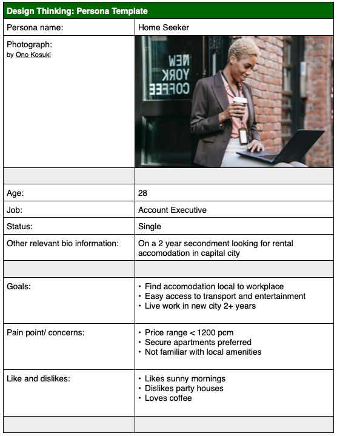
</details>

<details>
    <summary>Agent / Member User</summary>

- **Who are they?**
    - Early to established real-estate business with expertise in local region.
- **What is their main goal?**
    - Constantly feed new sales to maintain business growth and position. 
- **What is their main barrier to achieving their goal?**
    - Access to new customers wishing to engage their real-estate services.
- **Persona Card**:
    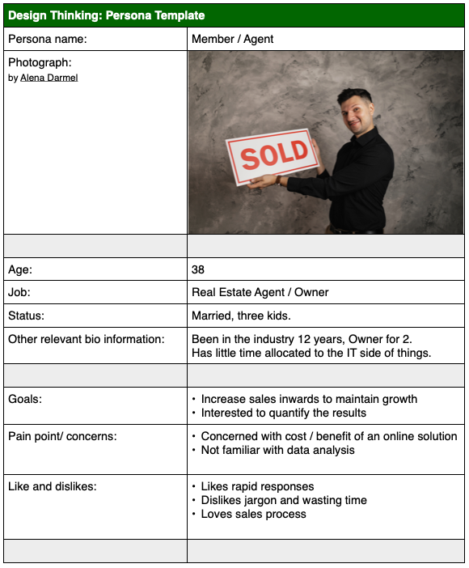
</details>

<details>
    <summary>Admin User</summary>

- **Who are they?**
    - New to intermediate, IT literate professionals looking for platform to manage B2C connections 
- **What is their main goal?**
    - Add value to businesses in the real-estate fields internationally.
- **What is their main barrier to achieving their goal?**
    - Access to cross platform sales funnel into existing management systems
- **Persona Card**:
    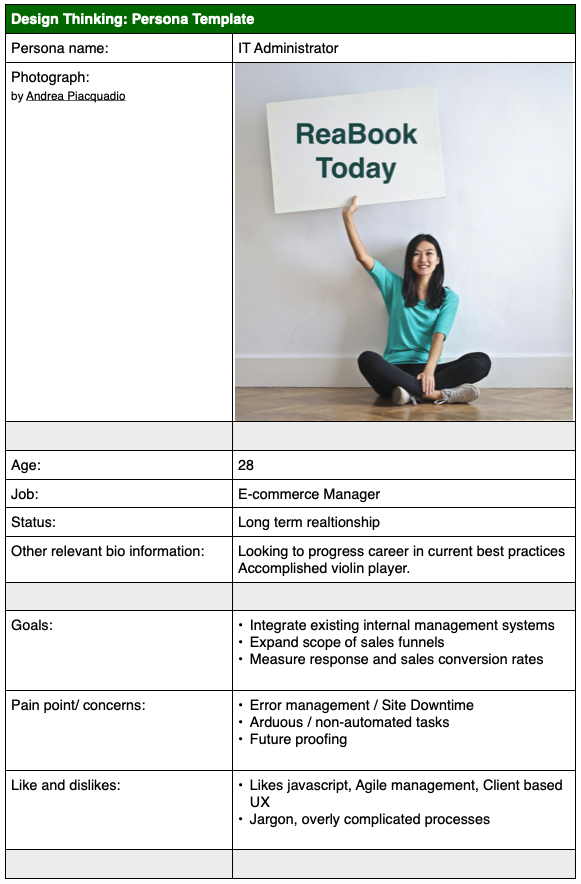
    </details>


### Requirements Analysis
Used to confirm understanding and documented check that each requirement is:    
* Clear
* Non-conflicting
* Has successfully completed a trade-off process between owner and development team as to what is important and what is feasible.

Consideration and documentation at this point as to:
* How will each requirement be implemented?
* How will each requirement be Tested?
* What is the process to evaluate each requirement? (to meet initial requirements)

<details>
<summary style="font-size: 1rem;">
Sample user story with acceptance criteria for the ReaBook project
</summary>


User Story: 
* As a **user**, I can **select the time I would like to visit a property** so that **I can arrange my day efficiently with little difficulty**.

**Acceptance Criteria**:

* [x] Booking details must include the time and date of intended appointment, the subject property address, the name, email and phone number of the person requesting the booking. 

* [x] The agent / employee is able to select the time of the booking details from 3 sessions during the the day (Morning, Afternoon and Evening).

* [x] The font size used in the conformation email is 12 point.

**Tasks**:

* [x] Design a “submit” button and add it to the booking details page.

* [x] Create the HTML and CSS for the dropdown menu including the booking times. 

* [x] Create the HTML, CSS and copy for the successful submission email.

* [x] Create the code for the model, viewer and controller.

* [x] Test the completed functionality that incldes email submission.

</details>

## 3. Implementation
### 3.1 Themes
Collect related epics that have something in common. In the project, this can be seen as:

User Experience (Theme)
* Account Registration journey (Epic)
* Add Property journey (Epic)
* Bookings journey (Epic)
* Sign in/out journey (Epic)

Account Management (Theme)
* Sign-in feature (Epic)
* User profile feature (Epic)
* Sign-up feature (Epic)

Property Management (Theme)
* Display multiple properties feature (Epic)
* Display single property feature (Epic)
* Add single property feature (Epic)
* Edit single property feature (Epic)

Booking Management (Theme)
* Display booking feature (Epic)
* Create booking feature (Epic)
* Update booking feature (Epic)
* Display multiple bookings feature (Epic)

### 3.2 Epics
Epics are larger multiple iteration that can be broken into user stories.
<details>
<summary style="font-size: 1rem;">
Epics are larger multiple iteration that can be broken into user stories.
</summary>
        
- Reabook Epics
    - [User Experience]()
    - [Site Framework]()
    - [Dataset Design]()
    - [Read Dataset]()
    - [Display Properties / Products]()
    - User Profile
        - [Admin User](static/documentation/wireframes/IT-Admin-Persona-ReaBook.png)
        - [Agent Member](static/documentation/wireframes/Owner-Agent-Persona-ReaBook.png) User (staff)
        - [Customer User](static/documentation/wireframes/Home-seeker-Persona-ReaBook.png)
    - [Sign In]()
    - [Register]()
    - [Create Property Listing]() (staff)
    - [Edit Property Listing]() (staff)
    - [Delete Property Listing]() (staff)
    - [Book Viewing]()
    - [Edit Viewing]()
    - [Delete Viewing]()
</details>

<details>

### 3.3 User Stories
- Cards: https://github.com/users/roeszler/projects/4/views/1
- Acceptance Criteria
- Tasks
- Story Point Value
- 

<summary style="font-size: 1rem;">
User Stories
</summary>

- [Customer User](https://github.com/roeszler/reabook/labels/User%20%28Customer%29)
- [Agent / Member User](https://github.com/roeszler/reabook/labels/User%20%28Member%29)
- [Admin User](https://github.com/roeszler/reabook/labels/User%20%28Admin%29)

</details>

## 4. Project Management
Continuing to promote the Agile framework of software development, where possible I implemented the following during completion of each [user story](https://github.com/roeszler/reabook/issues):  
### 4.1 Story Point Estimation
Difficult to estimate with current level of experience, focused on the amount of work done posthumously in most cases. This was primarily due to the errors that came with each development iteration and the relative simple or solutions to solve the problem. 

One such instance was the inclusion of a bootstrap dropdown as part of the booking process. This was aimed to sequentially lead the user booking a viewing appointment to the next step. 

The combined front end JavaScrip and backend Python solution to achieve the sequential update and display of the data entered became out of scope for the project and story points I had allocated to the task. 

As part of the [agile manifesto](https://agilemanifesto.org/) approach (responding to change over following a plan) the code was refactored to provide a more basic, consistent user experience that was achievable in the time-frame. 

### 4.2 Team Velocity
Considers an average amount of story points the development 'team' can manage to finish in one iteration of a particular length. 

As this is an average measure, and focus the ReaBook project was placed on gathering experience and testing hypotheses in my journey as a student, Team Velocity has not been calculated for a single student developer.

### 4.3 MoSCow Prioritization
This technique was invaluable to each stage of the development process with the looping approach of Agile development and continuous revision throughout each sprint. 

Each task was reviewed and re-reviewed considering where it's importance lies:
* Must Have - non negotiable (core, legal, security)
* Should Have - if work around available, not vital. Add significant value. (Performance improvements, minor defects fixes, new functionality).
* Could Have - delivered in their entirety in a best-case scenario. When a problem occurs and the deadline is at risk, one or more “could-have” items are dropped.
* Won’t Have - Agile team has agreed that the PBI wouldn’t be delivered. Possible reschedule to later iterations? Recorded to manage expectations always.

The culmination of the MoSCow prioritization process can be seen in those with an [on hold](https://github.com/roeszler/reabook/labels/on%20hold), [wontfix](https://github.com/roeszler/reabook/labels/wontfix) or [future release](https://github.com/roeszler/reabook/labels/future%20release) tags respectively.

### 4.4 Information Radiator(s)
As real-time, informative and straightforward work status display, a magnetic whiteboard with post-it notes was used to clarify current tasks and manage development time. 

Common contents included:
* Remaining user stories,
* User stories’ status in the current iteration,
* The progress toward the next sprint,  
* Total numbers of open defects
* Further research / assistance required

### 4.5 Sprints
Once the basic management processes of the project was devised, the software development proceeded in incremental cycles. Each activity was done in small loops (Sprints).

These reflect the iterative Agile approach, where development focus is on autonomy, collaboration and early, continuous delivery. This proved to make the project both adaptive and evolve as it progressed.  

<details>
    <summary style="font-size: 1rem;">
    For a more detailed look at the ReaBook development sprints (dropdown list)
    </summary>

- [Sprint 1 - Site Framework](https://github.com/roeszler/reabook/milestone/1)
- [Sprint 2 - View & Search Property](https://github.com/roeszler/reabook/milestone/6)
- [Sprint 3 - Make & Manage Bookings](https://github.com/roeszler/reabook/milestone/7)
- [Sprint 4 - Create Properties](https://github.com/roeszler/reabook/milestone/11)
- [Sprint 5 - Account Administration](https://github.com/roeszler/reabook/milestone/8)
- [Sprint 6 - Refactor Dependencies](https://github.com/roeszler/reabook/milestone/9)
- [Sprint 7 - Bugs, General Refactoring and Documentation](https://github.com/roeszler/reabook/milestone/10)

</details>

## 5. Design
### 5.1 Structure
The application is intended to allow users to easily navigate through an appointment request process. Navigation promotes users through property selection, booking, booking conformation and summary tables to confirm their booking request have been sent.
### 5.2 Application Mockup & Wireframes
Graphics of the application have been designed to show member users and users early concepts of user journeys before any coding started. They provided an indication of:

* The variety of functions required.
* The critical pathways of functions needed to reach each user outcome.
* The relationships between each function.
* The logical approach to code creation, promoting readability and aiding future fault-finding processes.
* The experience as users navigate through the booking application processes.

### Flowchart Mockups:

<details>
    <summary>
    Create Property Listing Flowchart
    </summary>
        

</details>

<details>
    <summary>
    Create Booking Flowchart
    </summary>
        

</details>

<details>
    <summary>
    Update Property Flowchart
    </summary>
        

</details>

<details>
    <summary>
    Edit / Delete Property Flowchart
    </summary>
        

</details>

<details>
    <summary>
    Critical Pathway - Booking
    </summary>
        

</details>


### UX Wireframes
Early representation of the look, feel and HTML structure of the project. Aids concept development and communication of ideas to stakeholders:

<details>
    <summary>
    Initial Concept - Landing Page Wireframe
</summary>

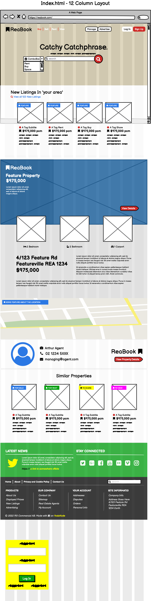
</details>

<details>
    <summary>
    Initial Concept - Booking App Wireframe
    </summary>
        
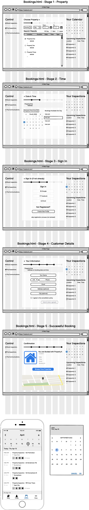
</details>

## 6. Features
### 6.1 Existing Features
### Landing Screen & Welcome
* The landing page is intended to ground the user into the primary purpose of the application, options to explore and key branding and iconography throughout the site.
* Site-wide navbar and search functionality
* My account dropdown list altered depending on user:
    <details><summary>Admin Menu</summary>

    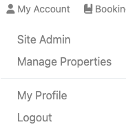
    </details>
    <details><summary>Agent / Member Menu</summary>
    
    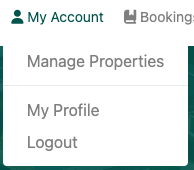
    </details>
    <details><summary>User Menu</summary>
    
    
    </details>
    <details><summary>Site Visitor Menu</summary>
    
    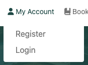
    </details>
* Bookings number indicator for logged in users

<details>
    <summary>
    ReaBook Landing Page Image
    </summary>
        
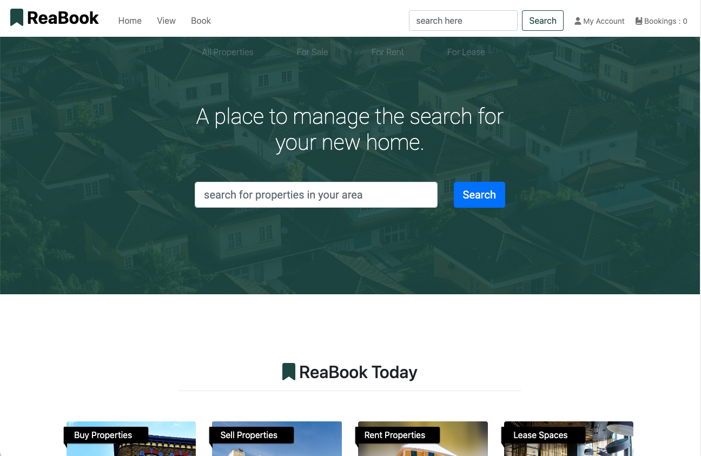
</details>

Key Features:
* Landing page panels will automatically be updated with the newest properties first.

    

    

### Search Results / View Properties
* The main view properties / search results page is intended to provide the user with a familiar format and function to searching properties as they would do with selecting a product on many popular e-commerce sites.

<details>
    <summary>
    ReaBook Properties View Page
    </summary>
        
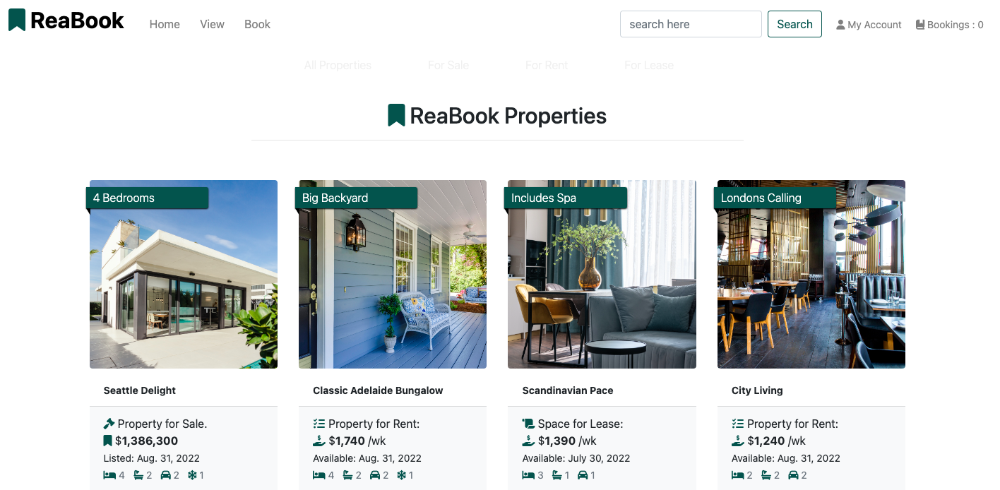
</details>

Key Features:
* Responsive layout from mobile first design principles to increased options for desktop users.
* If statements to automate the summary information displayed for each card
* Fallback image for properties without specific images supplied by user. 

### Place a Booking
* Takes the user through the process of submitting a request to the property agent for an appointment to view the property: 
<details>
    <summary>
    1. Choose Property
    </summary>
        
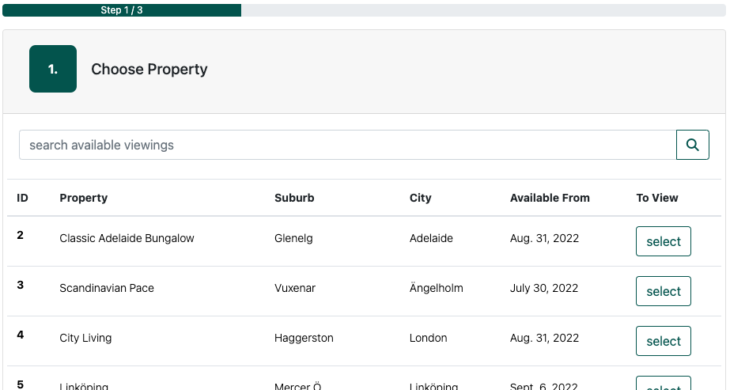
</details>

<details>
    <summary>
    2. Choose date and time
    </summary>
        
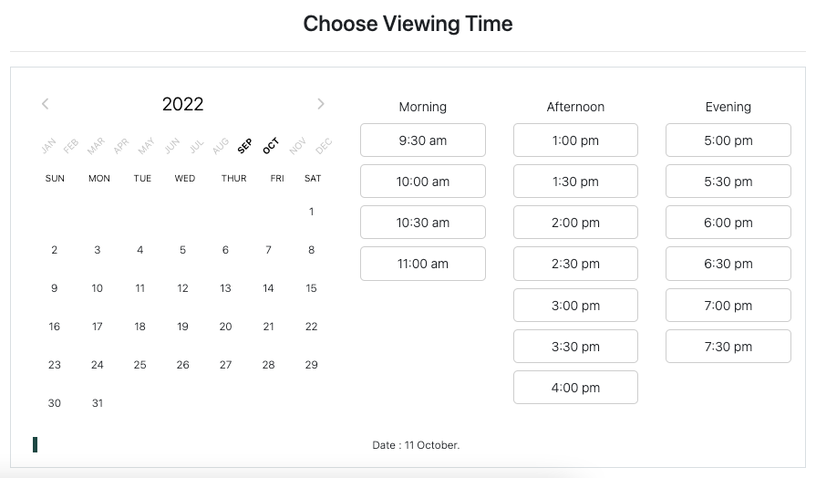
</details>

<details>
    <summary>
    3. Enter Details & Submit
    </summary>
        
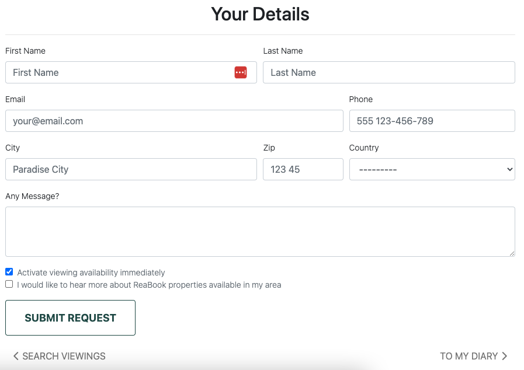
</details>

<details>
    <summary>
    4. Receive Conformation Email & Next Steps.
    </summary>
        
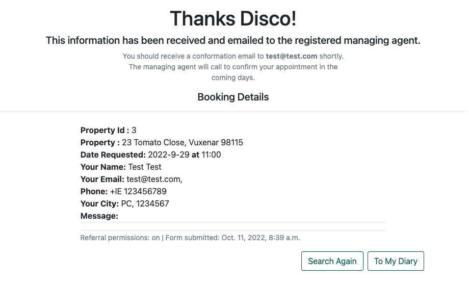
</details>

Key Features: 
* Create database entry function
* Local search function included should user land directly to bookings page
* Only displays properties checked as 'for viewing' by member agent user
* JavaScript function to manage time and date UI
* User delete as part of agents external booking system(s)
* Request appears in user specific right sidebar 'Quick Links'

### View / Update / Edit a Booking Request
* Provides option to update booking request details


<details>
    <summary>
    View / Update / Edit Booking Page
    </summary>
        
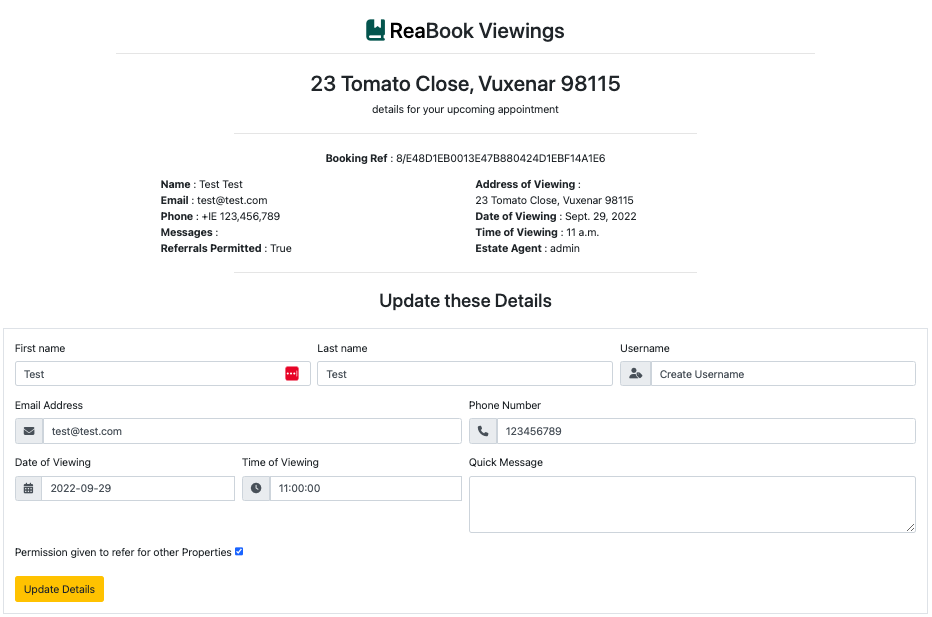
</details>

Key Features: 
* READ and UPDATE existing database entry function
* Nested property specific information
* Email sent to agent to confirm changes

### As a Member / Agent: 
### List a Property
* Enables Member / Agent as staff user to CREATE a new property listing as an entry in the database

<details>
    <summary>
    List Property Page
    </summary>
        
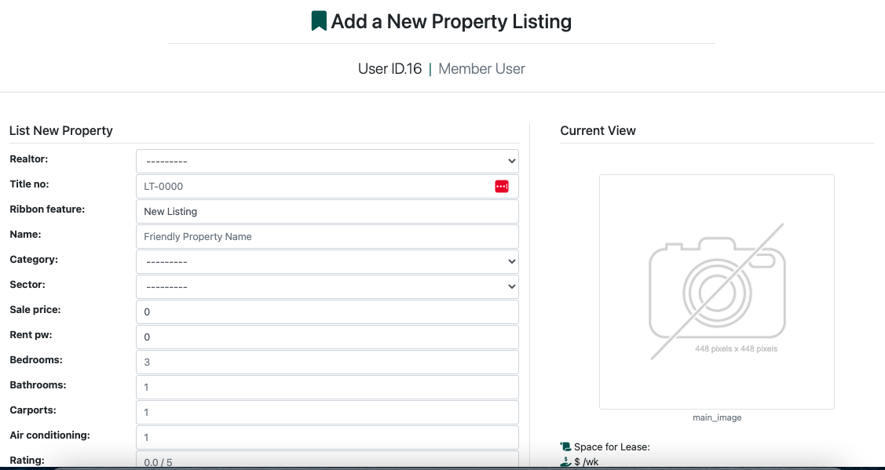
</details>

Key Features: 
* POST to database function
* request.FILES command included in CREATE function
* Required fields key for display view and data analytics longer term

### Edit / Update a Property Listing
* Enables Member / Agent as staff user to UPDATE the details of an existing property listing in the database

<details>
    <summary>
    Edit / Update a Property Page
    </summary>
        

</details>

Key Features: 
* POST to database function
* request.FILES command included in UPDATE function
* Pythonic ```.delete()``` delivers DELETE function on same page 
### Successful Submission
* 

<details>
    <summary>
    Successful Submission Pages
    </summary>
        

</details>

Key Features: 
* 

### 6.2 Possible Future Features
* 

## 7. Technologies
## 8. Testing
## 9. Deployment
## 10. Credits


---
__COPYRIGHT NOTICE__ :

 *The ReaBook site is a functional program intended for educational purposes at the time of coding. Notwithstanding, it has been written as a proof of concept and invitation to treat for a business [reabook.net](https://reabook.net/) and possible stakeholders into the future. Copyrights for code, ideas, concepts and materials strictly lies with Stuart Roeszler © 2022. All rights reserved.*