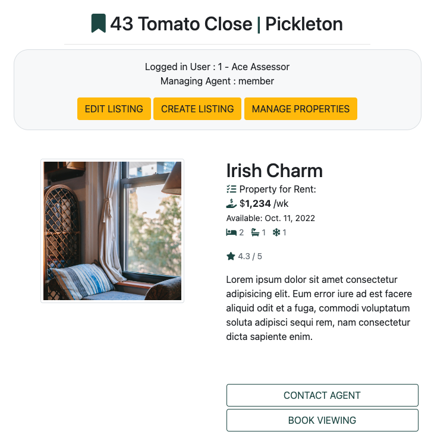

<!--  -->
# ReaBook Booking System

> **ReaBook** - attracts and drives initial bookings to view real estate for sale, rent or lease.

## Full Stack Toolkit with Django - [Code Institute](https://codeinstitute.net/)

### Applying: HTML, CSS, JavaScript, Python+Django, Relational Databases (PostgreSQL), c

* Repository link : https://github.com/roeszler/reabook
* Terminal : https://reabook.herokuapp.com/
* User Stories : https://github.com/users/roeszler/projects/4

---

<details>
<summary style="font-size: 1.5rem;">Table of Contents (dropdown list)</summary>

1. [Project Purpose](#1-project-purpose)
2. [Agile Development Process](#2-agile-development-process)
    * [Requirements Engineering](#21-understanding-requirements)
        * [User Centered Design](#22-implementation)
        * [Defining Requirements](#defining-the-requirements)

2. [User Experience Design](#2-user-experience-design)
    * [User Stories](#user-stories)
        * [First Time Visitor Goals](#first-time-visitors)
        * [Returning Visitor Goals](#returning-visitors)
        * [Coding Colleagues](#coding-colleagues)
    * [Design](#design)
        * [Imagery](#imagery)
        * [Fonts](#fonts)
        * [Color Scheme](#color-scheme)
        * [Site Mockup & Wireframe](#site-mockup--wireframe)
3. [Features](#3-features)
    * [Existing Features](#existing-features)
        * [Splash Screen (Gameplay & Rules)](#splash-screen--rules)
        * [Game Area](#game-area)
        * [Bet Amount Area](#bet-amount-area)
        * [Bet Type Area](#bet-type-area)
        * [Spin Button](#spin-button)
        * [Score Area](#score--bank-balance-area)
        * [Footer](#footer)
        * [PopUps](#popups-modals)
        * [Record User Choices](#choice-html)
    * [Future Features](#possible-future-features)
4. [Technologies](#4-technologies)
    * [Tools](#tools)
    * [Browsers](#supported-screens-and-browsers)
5. [Testing](#5-testing)
    * [Issues and Resolutions](#issues--resolutions)
    * [Validator Testing](#validator-testing)
6. [Deployment](#6-deployment)
    * [Display Environment](#display-environment-github--gitlab--bitbucket)
    * [Development Environment](#development-environment-gitpod)
7. [Credits](#7-credits)
    * [Content](#content)
    * [Media](#media)
</details>

---

## 1. Project Purpose
ReaBook (the Site) is the scaffold of a real estate advertising site used to present the deployment of an appointment booking system (the App) using a Full Stack Frameworks.

A primary personal focus of this project has been to learn to integrate agile processes, database functionality and form part of a larger professional portfolio. As a student I decided to extend myself into a scope larger than was required for portfolio project 4. This was done to practice, test and increase the depth of my experience in planning, design and implementation of full stack solutions.

### Database Functionality
At the time of release, the site is deployed via the [Heroku](https://www.heroku.com/platform) platform at https://reabook.herokuapp.com/. Here users can:
* Select and submit requests to attend store owner users arranged viewing times for properties listed for sale or rent.
    > Main nav > Book > (login) > Reabook Viewings

* Create, retrieve and navigate through orders to update information, check production status and/or re-book properties.
    > Create = Book Viewings button

    > Retrieve = View / Edit link

    > Navigate = Quick Links / My ReaBook menus

* Agent / Member / Admin users can list, edit and advertise times for potential customers to view properties currently for sale or rent in their business portfolio.
    > Property List = Manage Properties > Add Property

    > Property Edit = Manage Properties > Edit / Delete

### Note:
The ReaBook business premise is to collate and drive leads into existing appointment management systems, **not** provide appointment management service.

Reabook.site is a cross-agency site to dive leads for properties available for sale, rent, or spaces to lease. It is acknowledged that most all real estate services will already have well developed appointment management systems, so the ReaBook app is focused on enhancing the lead generation into these systems and provide advertising across all agents. 

<div align="right">

[Back to Top :arrow_up:](#table-of-contents)
</div>

## 2. Agile Development Process

Created by student developer; [Stuart Roeszler](https://www.linkedin.com/in/stuartroeszler/), the Reabook project has been developed following an Agile methodology as part of the assessment process at the [Code Institutes](https://codeinstitute.net/) - [Full Stack development program](https://codeinstitute.net/se/full-stack-software-development-diploma/). 

Agile [Project management](#23-project-management) processes, like [team velocity](#team-velocity) do not easily translate to a single person team. They would however form a crucial part of a live, team based project and have been outlined accordingly.
### 2.1 Requirements Engineering
#### User Centered Design (UCD) Process:
* User Centered Design (UCD) Process was used to identify key goals and structure the development process.
    <details>
    <summary style="font-size: 1rem;">
    For a more detailed look at the ReaBook UCD Process (dropdown list)
    </summary>
        
    - [Strategy](static/documentation/ucd/1-strategy.md)
    - [Scope](static/documentation/ucd/2-scope.md)
    - [Structure](static/documentation/ucd/3-structure.md)
    - [Skeleton](static/documentation/ucd/4-skeleton.md)
    - [Surface](static/documentation/ucd/5-surface.md)

    </details>

#### Defining the Requirements
Seen from activities undertaken in the UCD [strategy](static/documentation/ucd/1-strategy.md) and [scope](static/documentation/ucd/2-scope.md) panes, the requirements for the ReaBook project are: 

The primary directive was to make an online community looking for one-stop access to real estate available in an area.

> ReaBook: A single cross-agency site where users can interact to find and visit their next property solution. Users would be able to seek to properties in their region and be able to make bookings direct to member agents from our bookings store. Member Agent users will be able to list properties for sale, rent or lease and receive a customer stream into their businesses.


From this process, three primary user personas were defined:
<details>
    <summary>Customer User</summary>

- **Who are they?**
    - 18 to 45 years old, fully employed, professional couple &/or early stage family, further educated, non-local.
- **What is their main goal?**
    - Find rental accommodation, property purchase and/or lease of new business spaces in a variety of city and rural locations.
- **What is the main barrier to achieving their goal?**
    - Spread of multiple properties across multiple real-estate businesses makes search and access difficult.

- **Persona Card**:
    
</details>

<details>
    <summary>Agent / Member User</summary>

- **Who are they?**
    - Early to established real-estate business with expertise in local region.
- **What is their main goal?**
    - Constantly feed new sales to maintain business growth and position. 
- **What is their main barrier to achieving their goal?**
    - Access to new customers wishing to engage their real-estate services.
- **Persona Card**:
    
</details>

<details>
    <summary>Admin User</summary>

- **Who are they?**
    - New to intermediate, IT literate professionals looking for platform to manage B2C connections 
- **What is their main goal?**
    - Add value to businesses in the real-estate fields internationally.
- **What is their main barrier to achieving their goal?**
    - Access to cross platform sales funnel into existing management systems
- **Persona Card**:
    
    </details>


### Requirements Analysis
Used to confirm understanding and documented check that each requirement is:    
* Clear
* Non-conflicting
* Has successfully completed a trade-off process between owner and development team as to what is important and what is feasible.

Consideration and documentation at this point as to:
* How will each requirement be implemented?
* How will each requirement be Tested?
* What is the process to evaluate each requirement? (to meet initial requirements)

<details>
<summary style="font-size: 1rem;">
Sample user story with acceptance criteria for the ReaBook project
</summary>


User Story: 
* As a **user**, I can **select the time I would like to visit a property** so that **I can arrange my day efficiently with little difficulty**.

**Acceptance Criteria**:

* [x] Booking details must include the time and date of intended appointment, the subject property address, the name, email and phone number of the person requesting the booking. 

* [x] The agent / employee is able to select the time of the booking details from 3 sessions during the the day (Morning, Afternoon and Evening).

* [x] The font size used in the conformation email is 12 point.

**Tasks**:

* [x] Design a “submit” button and add it to the booking details page.

* [x] Create the HTML and CSS for the dropdown menu including the booking times. 

* [x] Create the HTML, CSS and copy for the successful submission email.

* [x] Create the code for the model, viewer and controller.

* [x] Test the completed functionality that incldes email submission.

</details>

## 3. Concept Development
### 3.1 Themes
Collect related epics that have something in common. In the project, this can be seen as:

<details>
<summary>User Experience (Theme)</summary>

* Account Registration journey (Epic)
* Add Property journey (Epic)
* Bookings journey (Epic)
* Sign in/out journey (Epic)
</details>

<details>
<summary>Account Management (Theme)</summary>

* Sign-in feature (Epic)
* User profile feature (Epic)
* Sign-up feature (Epic)
</details>

<details>
<summary>Property Management (Theme)</summary>

* Display multiple properties feature (Epic)
* Display single property feature (Epic)
* Add single property feature (Epic)
* Edit single property feature (Epic)
</details>

<details>
<summary>Booking Management (Theme)</summary>

* Display booking feature (Epic)
* Create booking feature (Epic)
* Update booking feature (Epic)
* Display multiple bookings feature (Epic)
</details>

### 3.2 Epics
Epics are larger multiple iteration that can be broken into user stories.
<details>
<summary style="font-size: 1rem;">
Epics are larger multiple iteration that can be broken into user stories.
</summary>
        
- Reabook Epics
    - [Dataset Design]()
    - [Site Framework]()
        - User Profile
            - [Admin User](static/documentation/wireframes/IT-Admin-Persona-ReaBook.png)
            - [Agent Member](static/documentation/wireframes/Owner-Agent-Persona-ReaBook.png) User (staff)
            - [Customer User](static/documentation/wireframes/Home-seeker-Persona-ReaBook.png)
        - [Sign In]()
        - [Register]()
        - [Site Pages]()
            - Login
            - Register
            - 
    - [User Experience]()
        - [Read Dataset]()
        - [Display Properties / Products]()
        - [Create Property Listing]() (staff)
        - [Edit Property Listing]() (staff)
        - [Delete Property Listing]() (staff)
        - [Book Viewing]()
        - [Edit Viewing]()
        - [Delete Viewing]()
</details>

### 3.3 User Stories
Reabook user stories have been produced in a brief format for simplicity. In a project with a team, a User Story Card would be used. Each card would contain:

- Acceptance Criteria
    - Subjectively confirms that the work on a particular user story is completed
- Tasks
    - Are the various individual activities carried out by the development team to implement each User Story as a “Task”
    - Each development team is responsible for
        - Identifying, assigning, and tracking tasks’ progress
        - Taking technical decisions required to deliver the user story
- Story Point Value
    - Are relative estimations focused on the amount of work needed to be done to complete the story
    - Are relative estimations compared to the other stories in the project

- Sample Story Card: https://github.com/roeszler/reabook/issues/48

### Reabook User Stories (summary)

- [Customer User](https://github.com/roeszler/reabook/labels/User%20%28Customer%29)
- [Agent / Member User](https://github.com/roeszler/reabook/labels/User%20%28Member%29)
- [Admin User](https://github.com/roeszler/reabook/labels/User%20%28Admin%29)

For a full description, jump ahead to: [Section 6. Features](#61-existing-features).
## 4. Project Management
Adhering to the Agile framework, where possible the following processes were completed during each [user story](https://github.com/roeszler/reabook/issues):  
### 4.1 Story Point Estimation
Difficult to estimate with current level of experience, focused on the amount of work done posthumously in most cases. This was primarily due to the errors that came with each development iteration and the relative simple or solutions to solve the problem. 

One such instance was the inclusion of a bootstrap dropdown as part of the booking process. This was aimed to sequentially lead the user booking a viewing appointment to the next step. 

The combined front end JavaScrip and backend Python solution to achieve the sequential update and display of the data entered became out of scope for the project and story points I had allocated to the task. 

As part of the [agile manifesto](https://agilemanifesto.org/) approach (responding to change over following a plan) the code was refactored to provide a more basic, consistent user experience that was achievable in the time-frame. 

### 4.2 Team Velocity
Considers an average amount of story points the development 'team' can manage to finish in one iteration of a particular length. 

As this is an average measure, and focus the ReaBook project was placed on gathering experience and testing hypotheses in my journey as a student, Team Velocity has not been calculated for a single student developer.

### 4.3 MoSCow Prioritization
This technique was invaluable to each stage of the development process with the looping approach of Agile development and continuous revision throughout each sprint. 

Each task was reviewed and re-reviewed considering where it's importance lies:
* Must Have - non negotiable (core, legal, security)
* Should Have - if work around available, not vital. Add significant value. (Performance improvements, minor defects fixes, new functionality).
* Could Have - delivered in their entirety in a best-case scenario. When a problem occurs and the deadline is at risk, one or more “could-have” items are dropped.
* Won’t Have - Agile team has agreed that the PBI wouldn’t be delivered. Possible reschedule to later iterations? Recorded to manage expectations always.

The culmination of the MoSCow prioritization process can be seen in those with an [on hold](https://github.com/roeszler/reabook/labels/on%20hold), [wontfix](https://github.com/roeszler/reabook/labels/wontfix) or [future release](https://github.com/roeszler/reabook/labels/future%20release) tags respectively.

### 4.4 Information Radiator(s)
As real-time, informative and straightforward work status display, a magnetic whiteboard with post-it notes was used to clarify current tasks and manage development time. 

Common contents included:
* Remaining user stories,
* User stories’ status in the current iteration,
* The progress toward the next sprint,  
* Total numbers of open defects
* Further research / assistance required

### 4.5 Sprints
Once the basic management processes of the project was devised, the software development proceeded in incremental cycles. Each activity was done in small loops (Sprints).

These reflect the iterative Agile approach, where development focus is on autonomy, collaboration and early, continuous delivery. This proved to make the project both adaptive and evolve as it progressed.  

<details>
    <summary style="font-size: 1rem;">
    For a more detailed look at the ReaBook development sprints (dropdown list)
    </summary>

- [Sprint 1 - Site Framework](https://github.com/roeszler/reabook/milestone/1)
- [Sprint 2 - View & Search Property](https://github.com/roeszler/reabook/milestone/6)
- [Sprint 3 - Make & Manage Bookings](https://github.com/roeszler/reabook/milestone/7)
- [Sprint 4 - Create Properties](https://github.com/roeszler/reabook/milestone/11)
- [Sprint 5 - Account Administration](https://github.com/roeszler/reabook/milestone/8)
- [Sprint 6 - Refactor Dependencies](https://github.com/roeszler/reabook/milestone/9)
- [Sprint 7 - Bugs, General Refactoring and Documentation](https://github.com/roeszler/reabook/milestone/10)

</details>

## 5. Design
### 5.1 Structure
The application is intended to allow users to easily navigate through an appointment request process. Users journey through finding and selecting property, choosing booking, booking conformation and summaries and tables to confirm their booking request have been sent.

### 5.2 Application Mockup & Wireframes
Graphics of the application have been designed to show member users and users early concepts of user journeys before any coding started. They provided an indication of:

* The variety of functions required
* The critical pathways of functions needed to reach each user outcome
* The relationships between each function
* The logical approach to code creation, promoting readability and aiding future fault-finding processes
* The experience as users navigate through the booking application processes

### Flowcharts Mockups:

<details>
    <summary>
    Site Map
    </summary>
        

</details>

<details>
    <summary>
    Member User C.R.U.D. Flowcharts
    </summary>

Flowchart 1:

</details>

<details>
    <summary>
    Customer User C.R.U.D. Flowcharts
    </summary>

Flowchart 1 - CREATE & READ


Flowchart 2 - UPDATE & DELETE

</details>


### Database Model:
The model is fairly simple, however of note is:

* The central part of the model is the Property table. This stores all the details about Member / Agent listed properties. 
* Two tables Category and Sector act as dictionaries to the Property table. 
* The employee and schedule tables are our administrative tables. 
* The other four tables deal with clients, client contacts, and the services provided.
* Note: that the name 'Property' is a [python attribute](https://docs.python.org/3.8/library/functions.html#property), so coding entailed the use of 'prop' or ''properties' or 'property_id' to avoid conflicts.

<details>
    <summary>
    Database Model
    </summary>
        

</details>


### UX Wireframes
Early representation of the look, feel and HTML structure of the project. Aids concept development and communication of ideas to stakeholders:

<details>
    <summary>
    Initial Concept - Landing Page Wireframe
</summary>


</details>

<details>
    <summary>
    Initial Concept - Booking App Wireframe
    </summary>
        

</details>

## 6. Features
### 6.1 Existing Features

<!-- ### [Sprint 1 - Site Framework](https://github.com/roeszler/reabook/milestone/1) -->
### Sign Up (Registration) and Login
The [allauth](https://django-allauth.readthedocs.io/en/latest/) third party package has been installed into the framework to handle the logic of user login, logout and registrations.

 

### Main Navigation Bar

Mobile:

* Site-wide navbar and search functionality
* My account dropdown menu that alters depending on user:
    * Non-Authenticated Site Visitor
    
        
    
    <details>
    <summary>Admin</summary>

    
    </details>
    <details><summary>Agent / Member Menu</summary>
    
    
    </details>
    <details><summary>User Menu</summary>
    
    
    </details>

* Bookings tally displays the number of bookings is indicated for authenticated users. This links to the [users diary](#existing-bookings-page) and indicated the total number of current bookings.


### Sub Navigation Bar
This feature has been added to include quick access to common classes and sectors that the ReaBook database models allows.


Key Features:
* JavaScript / JQuery event handler monitors the mouseover, dropdown and fade on scroll functions for this and the main navigation bar to a lesser extent.

* SubNav not present on mobile browsers

### Main Landing Page (index.html)
* The landing page is intended to ground the user into the primary purpose of the application, options to explore and key branding and iconography throughout the site.

<details>
    <summary>
    ReaBook Landing Page Image
    </summary>
        

</details>

Key Features:
* Landing page panels will automatically be updated with the newest properties first.

    

    

### Search Results / View Properties
* The main view properties / search results page is intended to provide the user with a familiar format and function to searching properties as they would do with selecting a product on many popular e-commerce sites.

<details>
    <summary>
    ReaBook Properties View Page
    </summary>
        

</details>

Key Features:
* Responsive layout from mobile first design principles to increased options for desktop users.
* If statements to automate the summary information displayed for each card
* Fallback image for properties without specific images supplied by user. 

### Request Booking Page
* Takes the user through the process of submitting a request to the property agent for an appointment to view the property: 
<details>
    <summary>
    1. Choose Property
    </summary>
        

</details>

<details>
    <summary>
    2. Choose date and time
    </summary>
        

</details>

<details>
    <summary>
    3. Enter Details & Submit
    </summary>
        

</details>

<details>
    <summary>
    4. Receive Conformation Email & Next Steps.
    </summary>
        

</details>

Key Features: 
* Create database entry function
* Local search function included should user land directly to bookings page
* Only displays properties checked as 'for viewing' by member agent user
* JavaScript function to manage time and date UI
* User delete as part of agents external booking system(s)
* Request appears in user specific right sidebar 'Quick Links'

### User Diary Page
This is intended to be the main pivot point for users that have made a booking. Properties will appear in table format in the main section of this page, with navigation options through the site on the left and shortcuts to existing bookings on the right.
<details>
    <summary>
    User Diary Page
    </summary>
        

</details>

### View / Update / Edit a Booking Request
* Provides option to update booking request details

<details>
    <summary>
    View / Update / Edit Booking Page
    </summary>
        

</details>

Key Features: 
* READ and UPDATE existing database entry function
* Nested property specific information
* Email sent to agent to confirm changes

### Forms
Django [forms](https://docs.djangoproject.com/en/4.1/topics/forms/) have been used to integrate the submitted data into the app. They are represented to the user in the add, edit and update both properties and bookings
### As a Member / Agent: 

### Property Management Landing Page
* Provides admin / member users a brief summary table of their current properties.
* This is intended to be the main pivot point for agent / member users that have created a property. Properties will appear in table format in the main section of this page, with navigation options through the site on the left.

<details>
    <summary>
    Property Management Landing Page
    </summary>
        

</details>

Key Features: 
* CREATE, READ and UPDATE existing database entry function
* Nested property specific information
* Summary address information only on mobiles

### List a Property
* Enables Member / Agent as staff user to CREATE a new property listing as an entry in the database

<details>
    <summary>
    List Property Page
    </summary>
        

</details>

Key Features: 
* POST to database function
* request.FILES command included in CREATE function
* Required fields key for display view and data analytics longer term

### Edit / Update a Property Listing
* Enables Member / Agent as staff user to UPDATE the details of an existing property listing in the database

<details>
    <summary>
    Edit / Update a Property Page
    </summary>
        

</details>

Key Features: 
* POST to database function
* request.FILES command included in UPDATE function
* Python code ```.delete()``` delivers DELETE function 
### Successful Submission
* System message indicating the the submission to CREATE, UPDATE or DELETE was successful providing the user with confidence that the process has completed.


### 6.2 Possible Future Features
* Edit User Profile & Passwords
* Extend account management functions 
* Member subscription model
* Refinement of style and feel. Current focus to have working C.R.U.D. functions
* Age depreciation of bookings / property listings according to days active
* ...

## 7. Technologies
### Tools
The skill-sets used in the creation and review of this project are based around a working knowledge of a full stack development approach using Agile methodologies with HTML, CSS, JavaScript (JQuery), Python, the Django framework, Bootstrap and Relational Database Design (SQLite and PostgreSQL). The tools and the benefit of using each in the application development are : 

* [GitHub](https://github.com/)
  * Allows a variety of benefits to create, document, store, showcase and share a project in development.
* [GitPod](https://www.gitpod.io/)
  * Provides a relatively secure workspace to code and develop software projects in a remotely accessible cloud based platform.
* [Heroku Platform](https://www.heroku.com/platform)
  * Provides a platform for deploying and running python based apps.
* The [Django Framework](https://www.djangoproject.com/) with embedded technologies as at version 3.2.15 and additional installations of:
  * [Allauth](https://django-allauth.readthedocs.io/en/latest/) to manage user authentication and management.
  * [Cloudinary](https://cloudinary.com/) Image and Video Upload, Storage, Optimization and Content Display Network.
  * [dj-database-url](https://pypi.org/project/dj-database-url/) to return a Django database connection dictionary, populated with data specified from the reabook URL.
  * [Gunicorn](https://gunicorn.org/) a Python Web Server Gateway Interface (WSGI) HTTP server.
  * [Pillow](https://pypi.org/project/Pillow/) part of the Python Imaging Library (PIL) adding image processing capabilities to the Python interpreter.
  * [django-countries](https://pypi.org/project/django-countries/) provides country choices for use with forms.
  * [django-crispy-forms](https://pypi.org/project/django-crispy-forms/) reusable layouts out of form components to avoid repetitive tasks (DRY).
* [Convertio Image Optimiser](https://convertio.co/)
  * Able to reduce the file size and format of images ready for rapid access, improving device performance, accessibility and user experience.
* [Lucidchart Flowchart Diagrams](https://www.lucidchart.com/pages/)
  * A diagramming application that allows the mapping and creation of flowcharts to visualise design workflows.
* [Balsamiq Wireframes](https://balsamiq.com/wireframes/)
  * A computer based low-fidelity UI wireframing tool to sketch up simple visuals assisting the concept development and planning stages.


### Supported Screens and Browsers
The live application ([ReaBook](https://reabook.herokuapp.com/)) has been tested on each of the following popular browsers to check for maintained function and interactivity :
- [Google Chrome](https://www.google.com/chrome/)
- [Microsoft Edge](https://www.microsoft.com/en-us/edge) 
- [Apple Safari](https://www.apple.com/safari/)
- [Mozilla Firefox](https://www.mozilla.org/en-US/firefox/new/)

## 8. Testing
A hybrid between a manual and automated approach to testing Python, Javascript and was followed using an Model, View and Controller (MVC) framework...

### MVC Testing
Model, View and Controller (MVC) testing....

### Manual Testing

A [testing tree](#critical-pathway-and-testing-tree) process has been performed to a documented process. Users/testers complete tasks by clicking through the app in a sequential way. In a live version the results of the task would indicate:
* How many users got it right?
* How many users got it wrong?
* The paths users took before they selected an answer.
* How long it took users to complete the task?
* Sample: see [critical pathway and testing tree](#critical-pathway-and-testing-tree) mentioned previously.

### Validator Testing
* [W3 Markup Validator](validator.w3.org)
    * No errors were found when passing through the W3 Markup validator
    * Results : [All right]()
* [W3 CSS Validator](https://jigsaw.w3.org/css-validator/)
    * No errors were found when passing through the W3 CSS validator
    * Results : [All right]()
* [PEP8 Python Validator](http://pep8online.com/)
    * No errors were found when passing through the PEP8 validator
    * Results : [All right]()

## 9. Deployment
This project was deployed using the Django Framework into Heroku. The steps to deploy are as follows:

* Fork or clone the [Code-Institute-Org: python-essentials-template](https://github.com/Code-Institute-Org/python-essentials-template)
* Click the Use this template to create a clone in GitHub
* Follow Display environment settings below:
### Display Environment (GitHub / GitLab / BitBucket)

The application has been deployed to GitHub pages. 

<details>
<summary>
The steps to deploy a clone of the GitHub repository...
</summary>

* Create / open an existing repository for the project with the name of your choice on your GitHub, GitLab or Bitbucket account page.
* Navigate within the GitHub repository you chose, and then navigate to the "settings" tab, which displays the general title.
* On the left hand navigation menu, I selected the "pages" option midway down the menu.
* At the top of the pages tab, the source section drop-down menu changed to select the branch: "main" with the folder selected as `"/(root)"`
* Committed to the save and waited a few moments for the settings to coordinate with the server. 
* On refresh of the browser, the dedicated ribbon changed to the selected web address, indicating a successful deployment.

> The live application link can be found here - https://reabook.herokuapp.com/

> The accessible GitHub repository for this application is https://github.com/roeszler/reabook
</details>

### Development Environment (GitPod)
The application has been deployed to GitPod pages during development. 

<details>
<summary >
The steps to deploy the project from GitHub to GitPod... 
</summary>

* In the GitHub, GitLab or Bitbucket account page where you created a repository for the project, navigate to the tab titled `'<> Code'`
* From here, navigate to the button on the top right of the repository navigation pane titled 'Gitpod'.
* If you press this it will create a new GitPod development environment each time.
</details>

<details>
<summary >
Alternatively, if you have already created the GitPod environment for your project...
</summary>

* In the browser’s address bar, prefix the entire URL with [gitpod.io/#](https://gitpod.io/#) or [gitpod.io/workspaces](https://gitpod.io/workspaces) and press Enter. This will take you to a list of workspaces that have been active within the past 14 days.
* Search for the workspace you wish to work on and access the link to it that lies within the pathway `https://gitpod.io/`.
* Sign in to the workspace each time with [gitpod.io/#](https://gitpod.io/#) using one of the listed providers (GitHub / GitLab / BitBucket) and let the workspace start up.
* On navigating to the workspace for the first time, it may take a little while longer than normal to initially install all it needs. Be patient.
* It is recommend that you install the GitPod browser extension to make this a one-click operation into the future.
</details>

### Full Stack Development Framework Environment (Django+Python)
A variety of frameworks are available for software development to provide generic functionality quickly. For the purposes of this project, the Django framework was used. A comprehensive tutorial of this process can be found at: [Django app Tutorial](https://docs.djangoproject.com/en/4.1/intro/tutorial01/).

<details>
<summary >
The basic CLI installation steps to install Django and dependencies...
</summary>

* pip3 install 'django<4'
* pip3 install gunicorn
* pip3 install dj_database_url
* pip3 install psycopg2
* pip3 install dj3-cloudinary-storage
* pip3 install django-allauth
* pip3 install pillow
* pip3 install django-countries
* pip install django-crispy-forms
* pip3 freeze --local > requirements.txt
* django-admin startproject proj_reabook .
* python3 manage.py startapp app_properties
* python3 manage.py startapp app_home
* python3 manage.py startapp app_bookings
* python3 manage.py startapp app_diary
</details>

<details>
<summary >
Once database models are configured...
</summary>

* python3 manage.py makemigrations --dry-run
* python3 manage.py makemigrations
* python3 manage.py migrate --plan
* python3 manage.py migrate
* python3 manage.py loaddata 'model_name'
</details>


### Deployment Environment (Heroku)
<details>
<summary >
The steps to create a server side Database and deploy to Heroku...
</summary>

* Login Heroku and create new Heroku app
* In 'settings' tab: set the buildpacks to `heroku/python`.
* In 'resources' tab: search and set the add-on to `heroku-postgresql` under a `hobby-dev` plan.
* In 'settings' tab: Reveal config vars, add and save KEY : VALUE variables in this order :
  * CREDS : Copy and paste entire contents of 'your' creds.json file
  * PORT : 8000
  * DATABASE_URL : Ensure a copy of the DATABASE_URL indicates something starting with `postgres://`.
  * SECRET_KEY : generate a unique key your self or somewhere like [netlify](https://django-secret-key-generator.netlify.app/)
* Within 'deploy' tab: choose GitHub as deployment method and link app to the repository
* Choose 'Deploy Branch' option you prefer.
* Optionally create and maintain a `env.py` file in you development environment using `.gitignore` functionality.

</details>

## 10. Credits
* Hosted at [Heroku](https://www.heroku.com/platform).
* Primary and additional Python coding was studied and reworked from modules provided through the Code Institute's [Diploma in Full Stack Software Development](https://codeinstitute.net/se/full-stack-software-development-diploma/), [W3 Schools](https://www.w3schools.com/), [Stack overflow](https://stackoverflow.com/), [mozilla.org](https://developer.mozilla.org/en-US/docs/Web/JavaScript) and [Django Project](https://www.djangoproject.com/).
* Testing tree process sourced from [Optimal Workshop](https://www.optimalworkshop.com/learn/101s/tree-testing/).
* 

---
__COPYRIGHT NOTICE__ :

 *The ReaBook site is a functional program intended for educational purposes at the time of coding. Notwithstanding, it has been written as a proof of concept and invitation to treat for a business [reabook.net](https://reabook.net/) and possible stakeholders into the future. Copyrights for code, ideas, concepts and materials strictly lies with Stuart Roeszler © 2022. All rights reserved.*